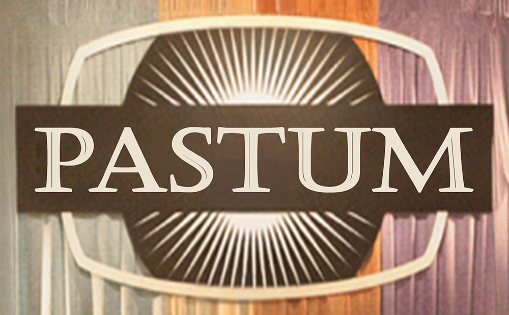
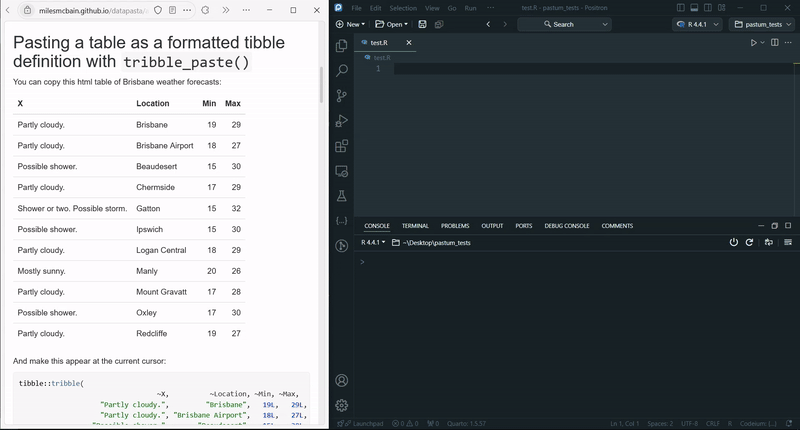

<!-- badges: start -->

<!-- badges: end -->

# pastum 

`pastum` lets you quickly transform any text/html table from your clipboard to a dataframe object of your favourite language — R, Python or Julia. Arrays (or vectors) are also supported for R and Python languages.

<figure>

</figure>

# Installation

You can install the development version from the [Releases](https://github.com/atsyplenkov/pastum/releases/) page. Download the latest `.vsix` file, and install it as described [here](https://code.visualstudio.com/docs/editor/extension-marketplace#_install-from-a-vsix).